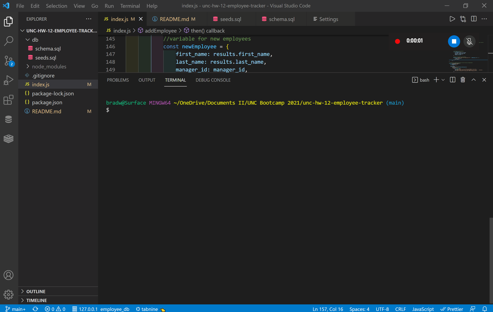

# Employee Manager

## A management system for employee information using the console to read and write to a database

## Table of Contents

- [Motivation and Technologies](#motivation)
- [Functionality](#functionality)
- [Challenges](#challenges)
- [Usage](#usage)

## Motivation

The goal of this project is to showcase the power of MySQL2 package and the Inquirer package to read and write to a SQL database.

#### Technologies

- Javascript
- node.js
- Inquirer package
- MySQL package
- console.table package
- Promise-MySQL package

## Functionality

[Video Walkthrough](https://drive.google.com/file/d/1zjRgEu18pOtm-ie2HL1FmoKbbFZSLHlU/view?usp=sharing)

#### The screencapture shows how a user would select and input information into the console

- The user will be prompted to answer questions in the console to allow them to see data from the SQL database or write to it

## Challenges

The major challenge faced when creating this application was figuring out some of the syntax to use for SQL queries.

## Usage

- Allows a user to select from a menu to see infromation from the SQL database or input data to write to the database.

## Future Development

- Add more customization in terms of what the user could do to the database such as updating employee managers and deleting departments, roles and employees
